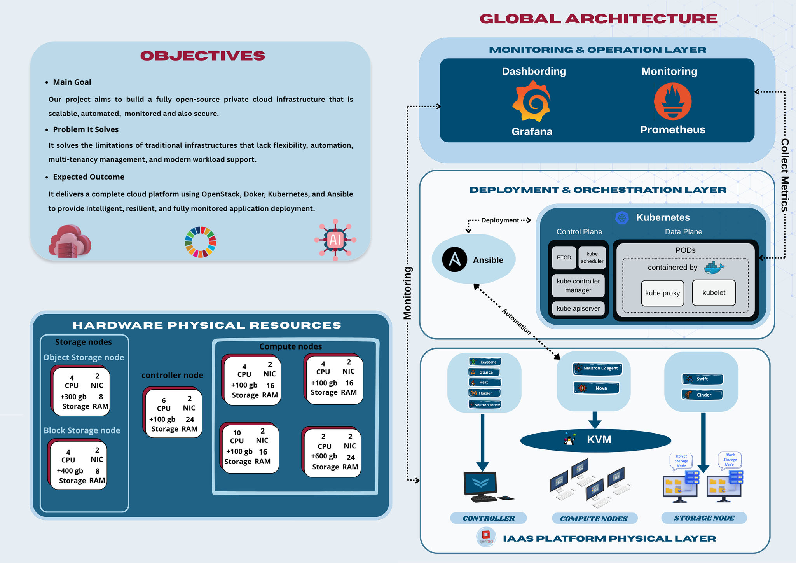
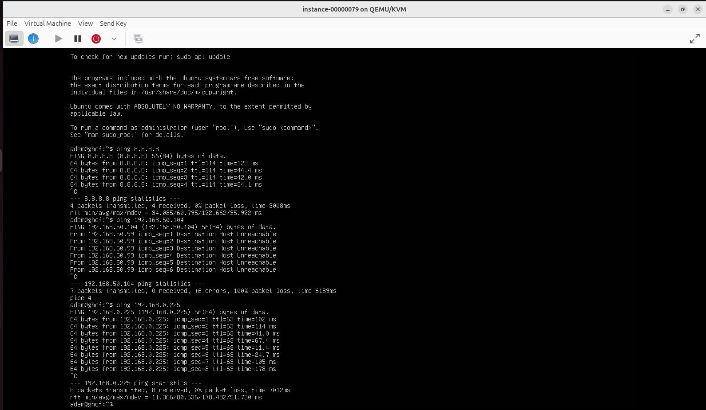
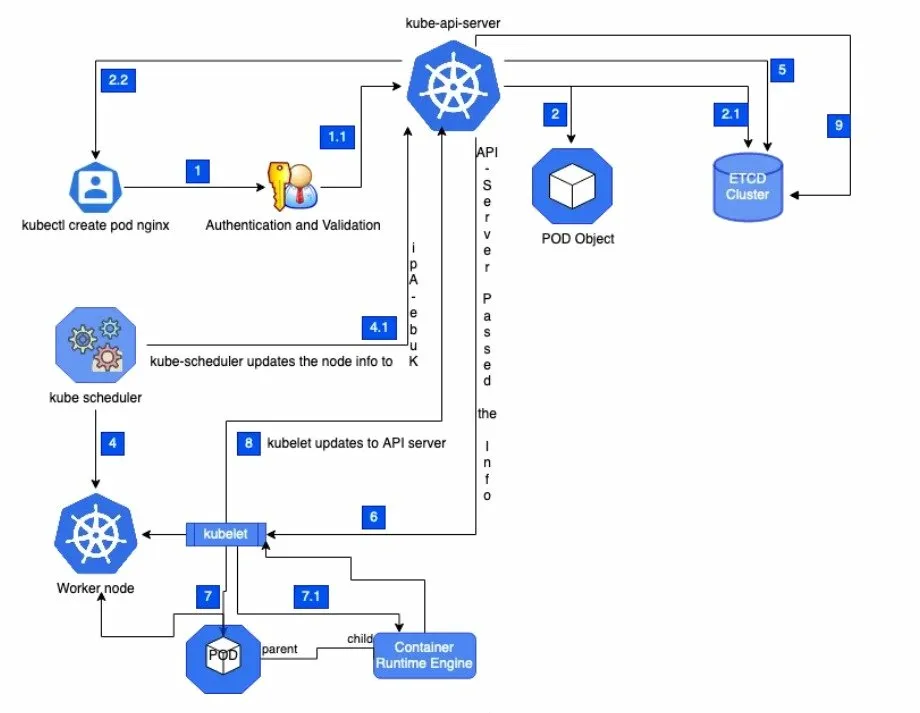
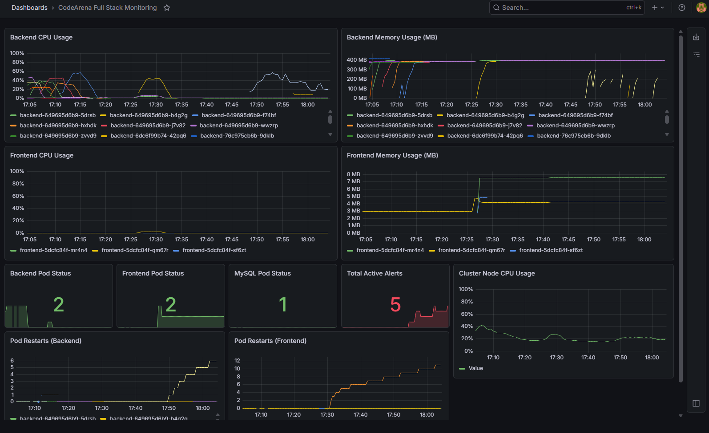
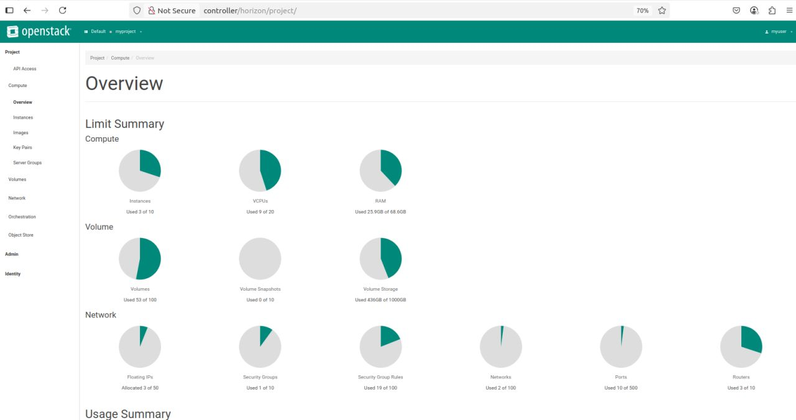
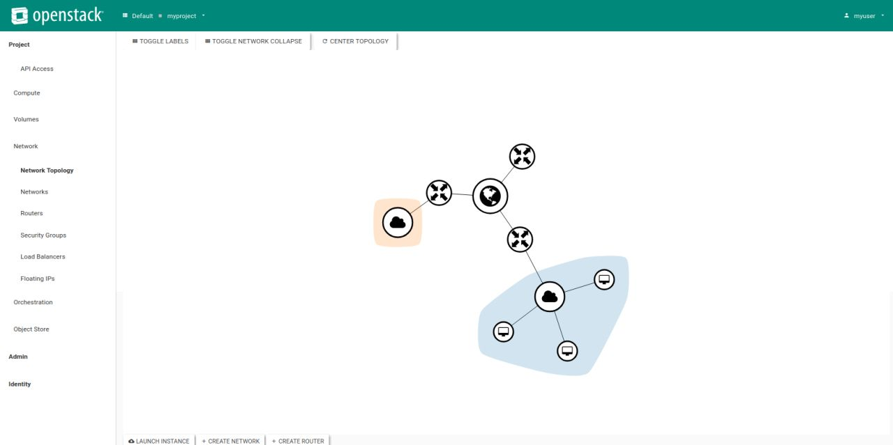
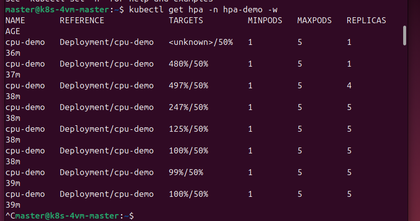
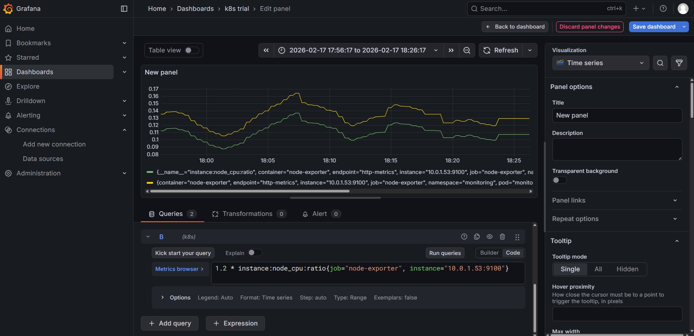
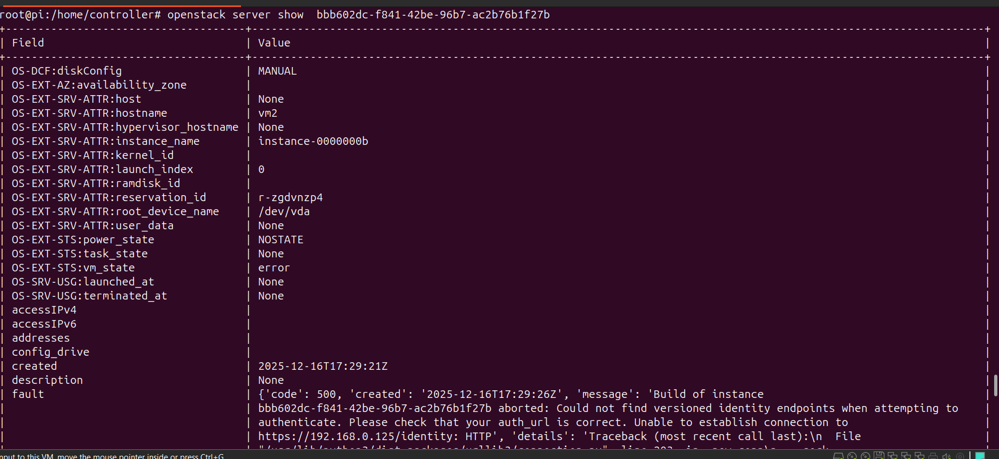

# Private Cloud Platform — OpenStack + Kubernetes

A fully open-source **private cloud** built by a team of 7 over the academic year, as the main project of my ArcTIC (IT Architecture & Cloud Computing) specialisation at ESPRIT. **Selected for ESPRIT's Bal des Projets.**

The goal: a scalable, automated, monitored and secure IaaS platform, then a Kubernetes layer on top to deploy and auto-scale real applications, with full observability.

> This repository documents the architecture and results. The infrastructure ran on VMware VMs in the lab and was not itself version-controlled, so this is a write-up with real screenshots rather than source code.

---

## The three layers

**1 · IaaS — OpenStack**
A multi-node OpenStack cloud (1 controller, compute nodes, object + block storage) providing IaaS, PaaS and SaaS:
- **Keystone** (identity), **Glance** (images), **Nova** + **KVM** (compute), **Neutron** (networking), **Horizon** (dashboard), **Cinder** (block storage), **Swift** (object storage), **Heat** (orchestration)

**2 · Orchestration — Kubernetes + Ansible**
- A Kubernetes cluster running on top of the OpenStack VMs, with the control plane (etcd, scheduler, controller-manager, api-server) and worker data plane
- **Ansible** for automated, repeatable provisioning
- Applications containerised with **Docker**

**3 · Monitoring & operations — Prometheus + Grafana**
- **Prometheus** scrapes metrics from the cluster and nodes (node-exporter)
- **Grafana** dashboards for CPU, memory, pod status and alerts

## My contribution

Over the year the team rotated through every layer as we each learned it. What I owned:
- **Compute nodes** deployment and large parts of the **controller** configuration
- The **Ansible automation** (control node + worker configuration)
- The final stage: **CI/CD with SonarQube**, and the **Prometheus / Grafana monitoring**
- Security hardening (RBAC, network policies)

---

## Results

### OpenStack running — Neutron network agents across the nodes
Open vSwitch, L3 and DHCP agents up across controller and compute hosts.

### Compute host (KVM/QEMU)
A Nova compute node running the KVM/QEMU hypervisor, reporting load and uptime.

### Cinder block storage (LVM)
Volumes provisioned through Cinder, backed by an LVM thin pool.

### OpenStack Horizon — live cloud usage
The Horizon dashboard showing real consumption across the platform: 3 instances, 53 volumes, 436 GB of volume storage, networks, routers and floating IPs.

### Network topology
Tenant network, router and instances as seen in Horizon.

### Kubernetes monitoring stack
The full kube-prometheus-stack (Prometheus, Grafana, Alertmanager, node-exporters) running in the `monitoring` namespace.

Grafana querying node-exporter metrics (`instance:node_cpu:ratio`) from the cluster:

### Horizontal Pod Autoscaler in action
Under CPU load the HPA scaled the deployment from 1 to 5 replicas automatically, then back down.

---

## Tech stack

`OpenStack` (Keystone · Glance · Nova · Neutron · Horizon · Cinder · Swift · Heat) · `KVM` · `VMware` · `Kubernetes` · `Docker` · `Ansible` · `Terraform` · `Prometheus` · `Grafana` · `SonarQube`

## Author

**Islem Azzouz** — Cloud & DevOps engineering student at ESPRIT
[Portfolio](https://islemazz.github.io) · [LinkedIn](https://www.linkedin.com/in/islem-azzouz-483265359) · [GitHub](https://github.com/islemazz)
